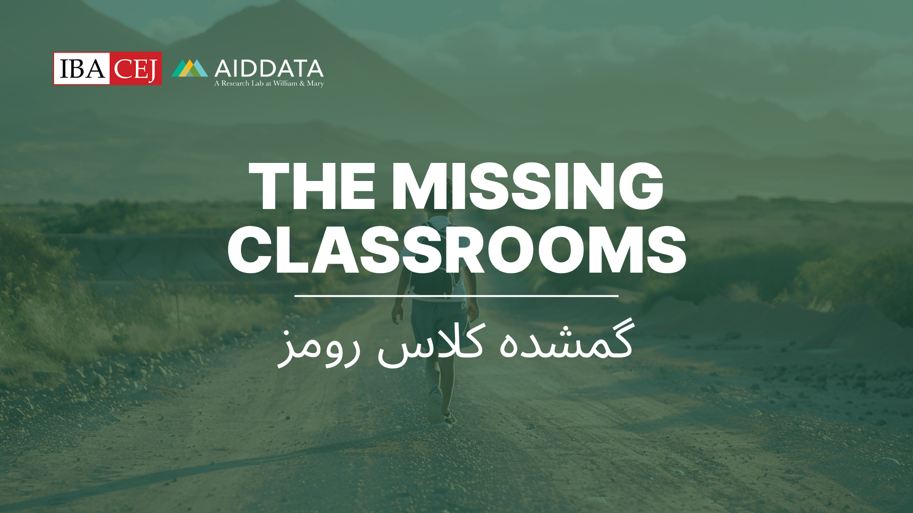

<div align="center">
  
</div>
<div align="center">
  <p>A Learning Activity for Data Journalism</p>
</div>

## Overview

"The Missing Classrooms" is an interactive data journalism investigation experience that teaches students how to analyze complex datasets, identify patterns, and uncover stories hidden in government data. Players take on the role of investigative journalists working to expose discrepancies in a fictional education program called "Schools for Every Child."

### Learning Objectives

- Learn to interpret complex datasets and identify anomalies
- Develop the ability to spot inconsistencies in financial and operational data
- Practice systematic approaches to data-driven journalism
- Understand how different data sources can reveal larger patterns
- Learn to build compelling narratives from quantitative evidence

---

## Getting Started

### Prerequisites

- Modern web browser (Chrome, Firefox, Safari, Edge)
- Local web server (for file access) or web hosting environment
- No additional software installations required

### Installation

1. **Clone or Download** the project files to your local machine
2. **Set up a local server** (required for file access):
   - **Python**: `python -m http.server 8000`
   - **Node.js**: `npx http-server`
   - **VS Code**: Use Live Server extension
   - **XAMPP/WAMP**: Place files in htdocs/www directory

3. **Open** `index.html` in your browser via the local server

### Quick Start

1. Open the application in your browser
2. Click "Begin" on the landing page
3. Enter your assigned team code (see Team Codes section)
4. Follow the tutorial slides to learn navigation
5. Start investigating by clicking the USB folder or email icon

---

## How to Use

### Navigation

- **Desktop Interface**: Mac-style desktop with clickable icons
- **USB Folder**: Access all investigation data files
- **Calculator**: Perform calculations during analysis
- **Email**: Read messages from the whistleblower "Ricky Martin"
- **Menu Bar**: Access help, home, and other tools

### Investigation Process

1. **Read the Whistleblower Email**: Get context about the investigation
2. **Explore Team Data**: Each team investigated different aspects:
   - **Community Impact**: Student access and educational outcomes
   - **Construction Oversight**: Building progress and completion rates
   - **Financial Crimes**: Budget allocation and spending patterns
   - **Geographic Justice**: Regional disparities and resource distribution
   - **Procurement**: Contractor relationships and bidding processes

3. **Analyze Cross-Team Patterns**: Look for connections between different investigations
4. **Document Findings**: Keep track of evidence and discrepancies
5. **Build Your Story**: Connect the dots between different data sources

---

## Team Codes

Enter one of these codes when prompted to begin your investigation:

| Team | Code | Focus Area |
|------|------|------------|
| **Community Impact Unit** | `compact` | Student access and educational outcomes |
| **Construction Oversight** | `construct` | Building progress and completion tracking |
| **Financial Crimes Investigation** | `finance` | Budget analysis and spending patterns |
| **Geographic Justice** | `geography` | Regional disparities and resource allocation |
| **Procurement Investigation** | `procure` | Contractor relationships and bidding processes |

---

## Project Structure

```
missing_classrooms/
├── index.html              # Landing page and team selection
├── app.html                # Main investigation interface
├── data/                   # Investigation datasets
│   ├── community_impact.json
│   ├── construction_oversight.json
│   ├── financial_crimes.json
│   ├── geographic_justice.json
│   └── procurement.json
├── img/                    # Assets and images
│   ├── CEJ_AidData.png
│   ├── mail.png
│   ├── Calculator_image.png
│   ├── USB_image.png
│   └── [other assets]
└── README.md               # This file
```

---

## Features

### Interactive Elements

- **Mac-Style Interface**: Familiar desktop environment
- **Email System**: Whistleblower communications with attachments
- **Data Explorer**: File browser for investigation documents
- **Built-in Calculator**: For quick data analysis

### Educational Components

- **📚 Tutorial System**: Step-by-step guidance for new users
- **🔍 Multi-Team Perspective**: Different investigation angles
- **📈 Real-World Data Patterns**: Based on actual government transparency issues
- **🎯 Progressive Disclosure**: Information revealed through exploration

---

## Technical Details

### Built With

- **HTML5**: Semantic structure and accessibility
- **CSS3**: Modern styling with glassmorphism effects
- **Vanilla JavaScript**: No external dependencies
- **Font Awesome**: Icon library
- **Tailwind CSS**: Utility-first styling framework

### Browser Compatibility

- ✅ Chrome 80+
- ✅ Firefox 75+
- ✅ Safari 13+
- ✅ Edge 80+

### Performance

- **Lightweight**: ~2MB total package size
- **Fast Loading**: Optimized assets and lazy loading
- **Offline Capable**: All resources included locally

---

## Educational Context

### Target Audience

- **Journalism Students**: Learning data analysis techniques
- **Data Literacy Courses**: Understanding government transparency
- **Civic Education**: Exploring public accountability
- **Professional Development**: Investigative methodology training

### Learning Outcomes

By completing this investigation, students will:

1. **Understand** how to approach complex datasets systematically
2. **Identify** red flags and anomalies in government spending data
3. **Cross-reference** multiple data sources for comprehensive analysis
4. **Document** findings in a structured, evidence-based manner
5. **Communicate** data-driven stories effectively

---

## The Story

### Background

The fictional country's "Schools for Every Child" program promised to build hundreds of new classrooms in underserved communities. However, a whistleblower named Ricky Martin has uncovered evidence that suggests widespread mismanagement, corruption, and negligence.

### Key Characters

- **Ricky Martin**: Whistleblower providing investigation data
- **Mario**: A student whose 12km daily walk to school symbolizes the program's failures
- **Investigation Teams**: Five specialized units examining different aspects of the scandal

### Real-World Connections

While fictional, the scenario reflects real challenges in:
- Government transparency and accountability
- Educational equity and access
- Public procurement corruption
- Data-driven investigative journalism

---

## Contributing

### For Educators

- **Customize Team Codes**: Modify codes in `index.html`
- **Update Data**: Replace JSON files with your own datasets
- **Adjust Difficulty**: Modify data complexity for different skill levels
- **Add Languages**: Translate interface elements

### For Developers

- **Report Issues**: Submit bugs or feature requests
- **Improve Accessibility**: Enhance screen reader compatibility
- **Add Features**: Extend functionality for new use cases
- **Optimize Performance**: Improve loading times and responsiveness

---

## License

This project is designed for educational use. Please respect the learning objectives and maintain the integrity of the investigation experience when adapting or redistributing.

---

## Credits

**Developed by**: AidData, a Research Lab at William & Mary
**Learning Experience Designer and Facilitator**: Sethu Nguna (AidData, Training and Instructional Design Manager)  
**Educational Partner**: CEJ (Center for Excellence in Journalism)  
**Year**: 2025

### Acknowledgments

- Real-world transparency advocates who inspire this work
- Educators who provide feedback and guidance
- Students who engage with data-driven storytelling
- Open source community for tools and resources

---

## Support

For questions, issues, or educational partnerships:

- **Technical Issues**: Check browser compatibility and local server setup
- **Educational Use**: Adapt content for your curriculum needs
- **Data Questions**: Explore the JSON files for detailed datasets
- **Feature Requests**: Consider contributing or submitting suggestions

---

**Remember**: The goal isn't just to find the missing classrooms, but to understand how systematic analysis of government data can reveal patterns of mismanagement and hold institutions accountable. Every dataset tells a story - your job is to listen carefully and tell it clearly.

---

*"Stay safe. Trust the data."* - Ricky Martin 
